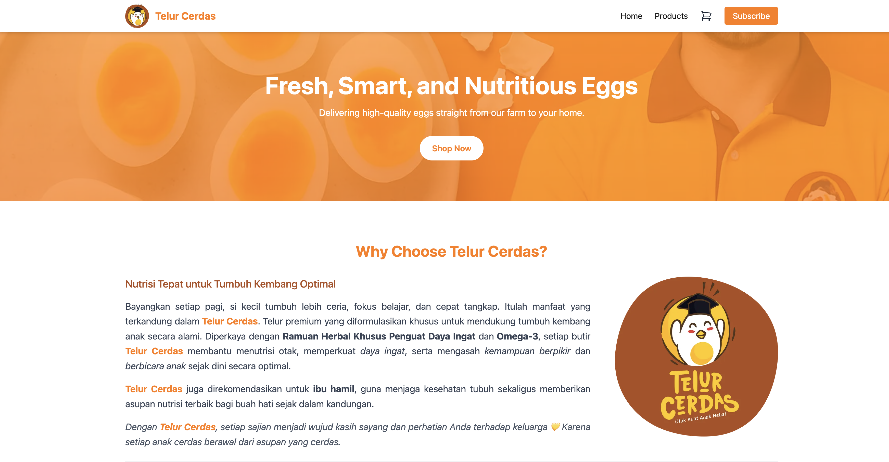

# TelurCerdas — Smart Egg Product Platform



<!-- Replace the image path with your actual screenshot or demo GIF -->

## 🌐 Live Demo

**Live Site:** [telurcerdas.vercel.app](https://telurcerdas.vercel.app/)

---

## 📖 Overview

**TelurCerdas** is a modern front-end web application built with **Next.js**, **TypeScript**, and **Tailwind CSS**, designed to showcase smart egg products in a clean, responsive, and user-friendly interface.

This portfolio-style e-commerce demo project includes product listing, testimonials, and subscription sections — optimized for both speed and clarity.

---

## ✨ Features

* 🥚 Product showcase with card-based layout
* 💬 Customer testimonials section
* 🧭 Smooth navigation with responsive **Navbar** and **Footer**
* 📩 Subscription form with validation-ready design
* ⚙️ Modular components for reusability
* 📱 Fully responsive design for all devices
* 🚀 Built with modern Next.js App Router architecture

---

## 🧠 Tech Stack

| Category             | Technology                                    |
| -------------------- | --------------------------------------------- |
| Framework            | [Next.js 14](https://nextjs.org/)             |
| Language             | [TypeScript](https://www.typescriptlang.org/) |
| Styling              | [Tailwind CSS](https://tailwindcss.com/)      |
| State Management     | React Context API                             |
| Deployment           | [Vercel](https://vercel.com/)                 |
| Linting & Formatting | ESLint + Prettier                             |

---

## 🗂️ Project Structure

```
TELURCERDAS/
├── assets/                    # Screenshots, icons, images
├── public/                    # Public assets
├── src/
│   ├── app/
│   │   ├── api/              # API routes (if any)
│   │   ├── cart/             # Shopping cart-related logic
│   │   ├── context/          # React Context for global state
│   │   ├── products/         # Product listing and logic
│   │   ├── layout.tsx        # Global layout wrapper
│   │   └── page.tsx          # Home page
│   ├── components/            # Reusable UI components
│   │   ├── Footer.tsx
│   │   ├── Hero.tsx
│   │   ├── Navbar.tsx
│   │   ├── ProductCard.tsx
│   │   ├── SubscribeForm.tsx
│   │   └── Testimonials.tsx
│   ├── styles/
│   │   └── globals.css        # Global CSS styles
│   └── favicon.ico
├── .gitignore
├── .prettierrc
├── eslint.config.mjs
├── next.config.mjs / next.config.ts
├── package.json
├── postcss.config.mjs
├── tailwind.config.ts
├── tsconfig.json
└── README.md
```

---

## 💼 Main Components

### 🧭 `Navbar.tsx`

Navigation bar for main site links and brand logo.

### 🎯 `Hero.tsx`

Prominent landing section with product highlight and call to action.

### 🧺 `ProductCard.tsx`

Reusable component to display individual product cards with image and description.

### ⭐ `Testimonials.tsx`

Showcases customer testimonials and product satisfaction feedback.

### 📩 `SubscribeForm.tsx`

Form for newsletter or updates — styled and ready for backend integration.

### 🦶 `Footer.tsx`

Footer with copyright and social links.

---

## 🛠️ Setup & Installation

1. **Clone the repository:**

```bash
git clone https://github.com/<your-username>/telurcerdas.git
cd telurcerdas
```

2. **Install dependencies:**

```bash
npm install
# or
yarn install
```

3. **Run the development server:**

```bash
npm run dev
```

4. **Open your browser:**

```
http://localhost:3000
```

---

## 📸 Screenshots / Demo

Add project visuals here:

```
assets/
 ├── telurcerdas-screenshot.png
 └── telurcerdas-demo.gif
```

---

## 🚀 Deployment

Deploy easily on **Vercel**:

```bash
npm run build
vercel deploy
```

---

## 🧩 Future Improvements

* Add product detail pages with dynamic routing
* Integrate cart checkout system
* Add CMS (Sanity / Contentlayer) for dynamic content
* Add dark/light mode toggle

---

## 🧑‍💻 Author

**Fiqrie**
Front-End Developer — passionate about clean UI and web performance.

🌐 [Portfolio](https://fiqrie-portfolio.vercel.app/)
🐙 [GitHub](https://github.com/vetacode)

---

## 🪪 License

MIT © 2025 Fiqrie
